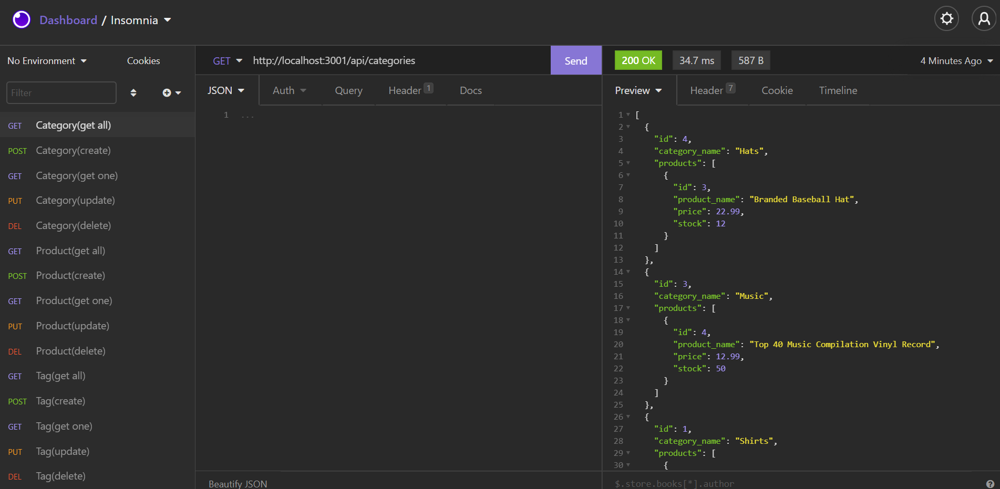

# orm-emoney
 * 

  ## Description
  The application is designed to show back end routes for an ecommerce site.  Using Node.js, express, MySQL and Sequelize you can navigate through routes of the ecommerce site.

  ## Table of Contents
  * [Installation](#installation)
  * [Usage](#usage)
  * [Walkthrough-Link](#walkthrough-link)
  * [Result-Screenshot](#result-screenshot)
  * [Tests](#tests)
  * [Questions](#questions)
  * [License](#license)

  
  ## Installation
  *  Clone the repo
  *  Navigate to the root directory location in your terminal and type npm install
  *  Make sure to creater your .env file with your MySQL info.
  
  
  ## Usage
  Using Insomnia core we test the api routes to create, read, update, and delete multiple aspects of the ecommerce site.
  
  
  ## Walkthrough-Link
  
  [Walkthrough Video](https://drive.google.com/file/d/1cTqGUCnk9Cwec32F54YvOXZ8Gp7P_We_/view)
  
  
  ## Result-Screenshot
  
  
  
  
  ## Tests
  Open Insomnia core and start testing different POST, PUT, GET, DELETE routes.
  
  
  ## Questions
  GitHub: [J2021T](https://github.com/J2021T)

  EMAIL: [jordan.turcott@gmail.com](mailto:jordan.turcott@gmail.com)
  
  
  ## License
  This project is covered under the [MIT](../assets/license-files/MIT.txt) license.

 
